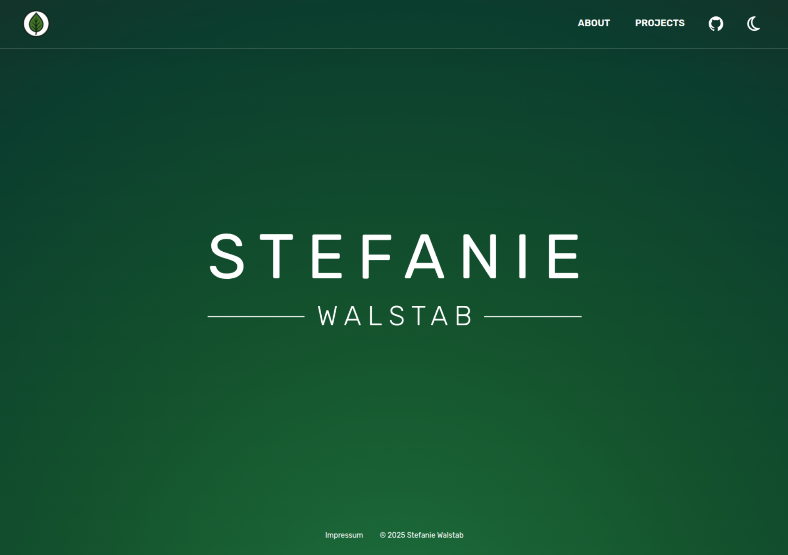
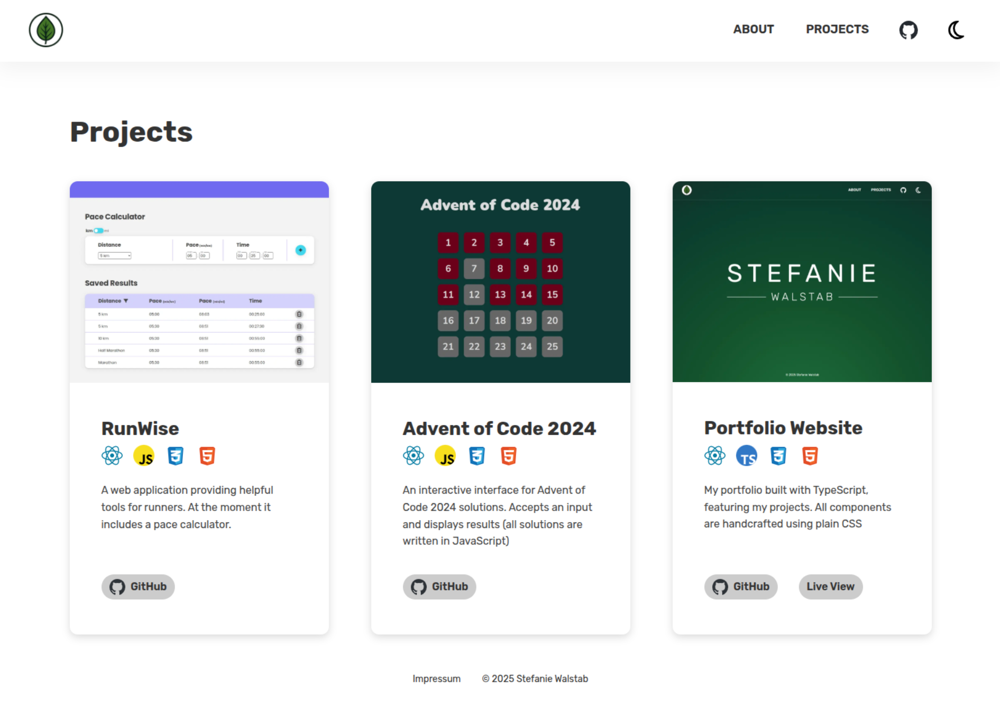
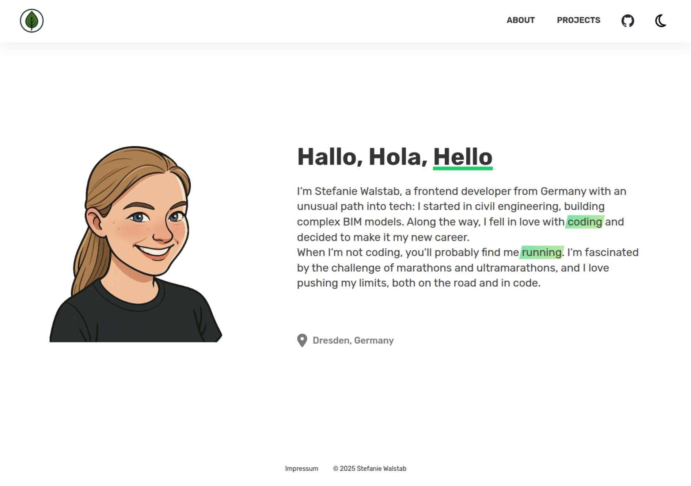

# Portfolio Website

This repository contains the source code for my personal portfolio website, built with **React** and **TypeScript**. It showcases a modern, responsive design created with **modern CSS** techniques.

## Live Demo

[website](https://swalstab.netlify.app/)

## Features

- Built with **React** and **TypeScript**
- Styled using **modern CSS** (Flexbox, Grid, custom properties, etc.)
- Fully **responsive** design for all screen sizes

## Getting Started

To run the project locally, make sure you have **Node.js** and **npm** installed.

1. Clone the repository:

   ```bash
   git clone https://github.com/swalstab/portfolio.git
   cd portfolio
   ```

2. Install dependencies:

   ```bash
   npm install
   ```

3. Start the development server:

   ```bash
   npm run dev
   ```

4. Open your browser at `http://localhost:3000` (or the port shown in your terminal).

## Project Structure

```
/src
  /components   # Reusable React components
  /pages        # Main page components
  main.tsx      # App entry point
  ...
```

## Dependencies

- React
- TypeScript
- Vite

## Screenshots

### Homepage



### Project Page



### About Page


